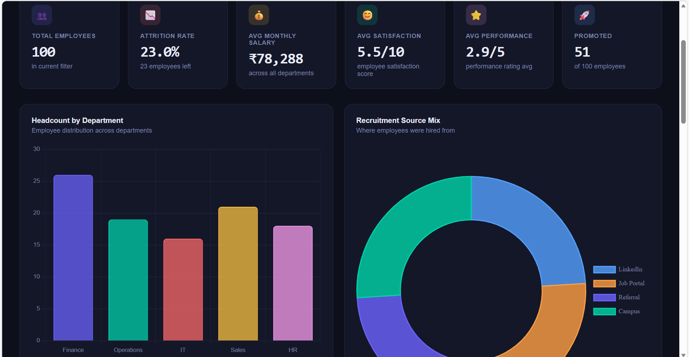

# HR-DASHBOARD 📊

A comprehensive **HR Analytics Dashboard** designed to visualize workforce data, recruitment trends, and employee insights.  
This project demonstrates how HR datasets can be transformed into actionable insights using **workflow automation, dashboard visualization, and interactive analytics**.

---

## 📂 Repository Contents
- **Dashboard.png** → Static snapshot of the HR Analytics Dashboard  
- **HR Analytics Dashboard.html** → Interactive dashboard interface (open in browser)  
- **hr_data.csv.xlsx** → Dataset containing HR metrics and employee records  

---

## 🎯 Project Objectives
- Provide HR managers with **data-driven insights** for recruitment and retention.  
- Automate HR workflows for efficiency.  
- Visualize employee demographics, attrition, and satisfaction metrics.  
- Showcase integration of **n8n workflow automation** with **Power BI / Chart.js dashboards**.  

---

## 🚀 Features
- **Employee Demographics**: Age, gender, education, and department distribution.  
- **Recruitment Pipeline**: Track hiring stages and conversion rates.  
- **Attrition & Retention**: Identify patterns in employee turnover.  
- **Interactive KPIs**: Drill-down charts for job satisfaction, salary ranges, and tenure.  
- **Workflow Automation**: HR data ingestion and dashboard updates via n8n.  

---

## 🖼️ Dashboard Preview


---

## 🌐 Interactive Dashboard
Preview of the interactive HTML dashboard:  


Open the HTML file locally to explore the interactive dashboard:

```bash
HR Analytics Dashboard.html
